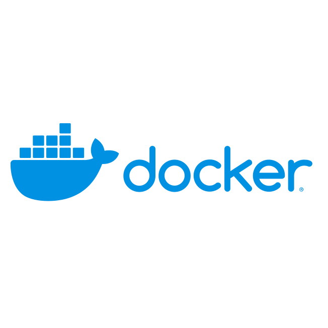

# Greetings!! Eric Díaz's here! 🙋🏼‍♂️

An audiovisual degree graduated man interested mainly in web programming (💻🖼️Front-End mostly) and also on content's edition🎞️🎚️.

On this "journey" i've been learning the ⬇️following⬇️ languages / softwares / tools:

You're able to find and contact me on these media:

<!--
**EricDiCiv5/EricDiCiv5** is a ✨ _special_ ✨ repository because its `README.md` (this file) appears on your GitHub profile.

Here are some ideas to get you started:

- 🔭 I’m currently working on ...
- 🌱 I’m currently learning ...
- 👯 I’m looking to collaborate on ...
- 🤔 I’m looking for help with ...
- 💬 Ask me about ...
- 📫 How to reach me: ...
- 😄 Pronouns: ...
- ⚡ Fun fact: ...
-->
